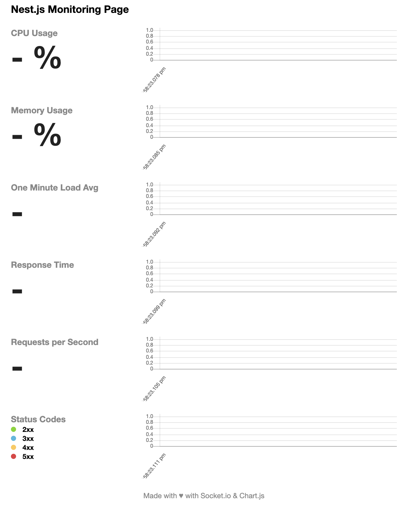
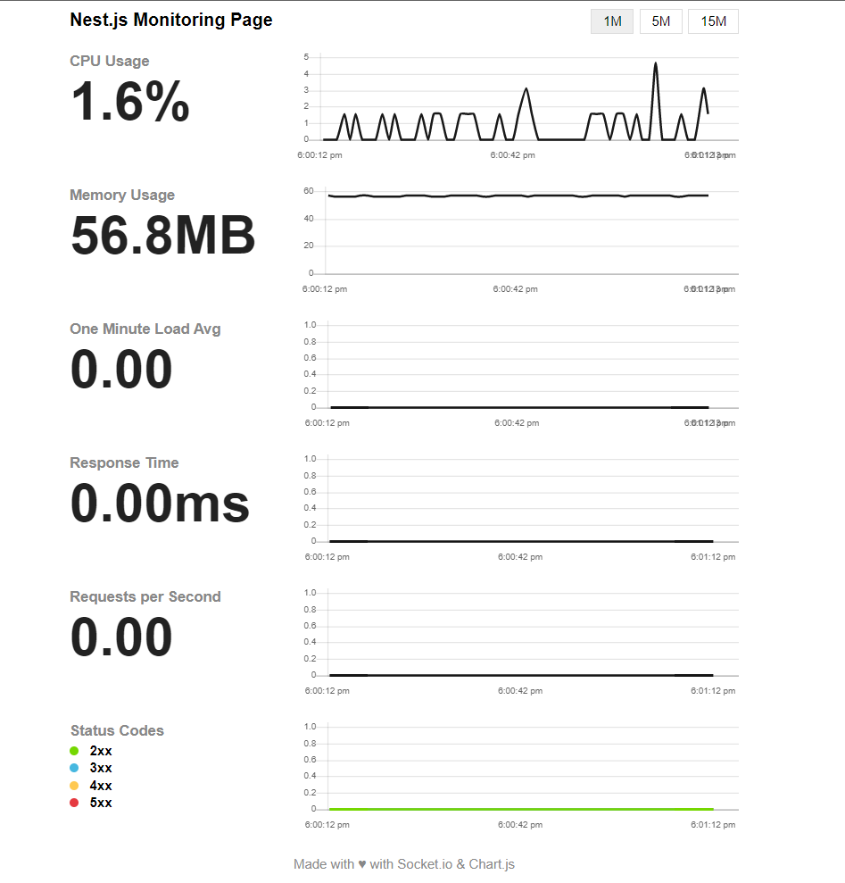
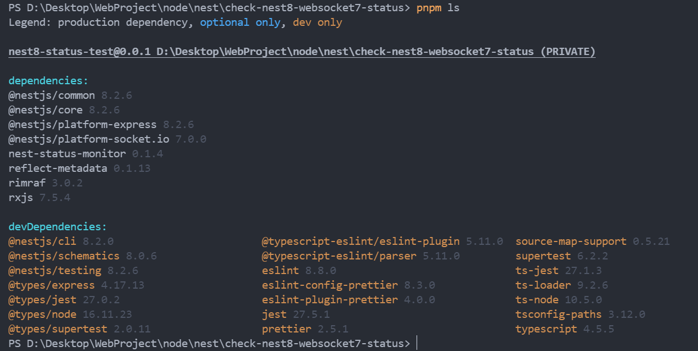

# nestjs整合nest-status-monitor后监控页面webscoket访问400 404

> Nestjs integration nest-status-monitor then monitoring page throw Webscoket access 400 404

+ Github：[https://github.com/JYbill/nest8-websocket7-status-monitor](https://github.com/JYbill/nest8-websocket7-status-monitor)
+ Gitee：[https://gitee.com/JYbill/nest8-websocket7-status-monitor](https://gitee.com/JYbill/nest8-websocket7-status-monitor)
+ issue：https://github.com/GenFirst/nest-status-monitor/issues/12

> 官方并没有给出后续解决，2020年之后官方再没有任何回复，希望我这篇博客有帮助到你😀
>
> The official did not give a follow-up solution, and there was no official reply after 2020. I hope this blog can help you

+ 错误样子👺

> Repetition error




+ 解决办法✔️

> solution

将你的`package.json`文件里面的`websocket.io`修改到`7.0.0`版本再次`pnpm/npm/yarn i`即可

> Change `websocket.io` in your `package.json` file to version 7.0.0 and run again will find its fine

```json
"dependencies": {
    "@nestjs/common": "^8.0.0",
    "@nestjs/core": "^8.0.0",
    "@nestjs/platform-express": "^8.0.0",
    "@nestjs/platform-socket.io": "7.0.0",
    "nest-status-monitor": "^0.1.4",
    "reflect-metadata": "^0.1.13",
    "rimraf": "^3.0.2",
    "rxjs": "^7.2.0"
    ...
}
```


+ 我的测试环境的`package.json`

> my test `package.json` env

```json
{
  "name": "nest8-status-test",
  "version": "0.0.1",
  "description": "test nest8 socket.io7 and nest-status-monitor is fine",
  "author": "",
  "private": true,
  "license": "UNLICENSED",
  "scripts": {
    "prebuild": "rimraf dist",
    "build": "nest build",
    "format": "prettier --write \"src/**/*.ts\" \"test/**/*.ts\"",
    "start": "nest start",
    "dev": "nest start --watch",
    "start:debug": "nest start --debug --watch",
    "start:prod": "node dist/main",
    "lint": "eslint \"{src,apps,libs,test}/**/*.ts\" --fix",
    "test": "jest",
    "test:watch": "jest --watch",
    "test:cov": "jest --coverage",
    "test:debug": "node --inspect-brk -r tsconfig-paths/register -r ts-node/register node_modules/.bin/jest --runInBand",
    "test:e2e": "jest --config ./test/jest-e2e.json"
  },
  "dependencies": {
    "@nestjs/common": "^8.0.0",
    "@nestjs/core": "^8.0.0",
    "@nestjs/platform-express": "^8.0.0",
    "@nestjs/platform-socket.io": "7.0.0",
    "nest-status-monitor": "^0.1.4",
    "reflect-metadata": "^0.1.13",
    "rimraf": "^3.0.2",
    "rxjs": "^7.2.0"
  },
  "devDependencies": {
    "@nestjs/cli": "^8.0.0",
    "@nestjs/schematics": "^8.0.0",
    "@nestjs/testing": "^8.0.0",
    "@types/express": "^4.17.13",
    "@types/jest": "27.0.2",
    "@types/node": "^16.0.0",
    "@types/supertest": "^2.0.11",
    "@typescript-eslint/eslint-plugin": "^5.0.0",
    "@typescript-eslint/parser": "^5.0.0",
    "eslint": "^8.0.1",
    "eslint-config-prettier": "^8.3.0",
    "eslint-plugin-prettier": "^4.0.0",
    "jest": "^27.2.5",
    "prettier": "^2.3.2",
    "source-map-support": "^0.5.20",
    "supertest": "^6.1.3",
    "ts-jest": "^27.0.3",
    "ts-loader": "^9.2.3",
    "ts-node": "^10.0.0",
    "tsconfig-paths": "^3.10.1",
    "typescript": "^4.3.5"
  },
  "jest": {
    "moduleFileExtensions": [
      "js",
      "json",
      "ts"
    ],
    "rootDir": "src",
    "testRegex": ".*\\.spec\\.ts$",
    "transform": {
      "^.+\\.(t|j)s$": "ts-jest"
    },
    "collectCoverageFrom": [
      "**/*.(t|j)s"
    ],
    "coverageDirectory": "../coverage",
    "testEnvironment": "node"
  }
}

```


+ 成功的截图

> Successful screenshots




+ 最终我使用所有依赖的版本

> I ended up using all the dependent versions



